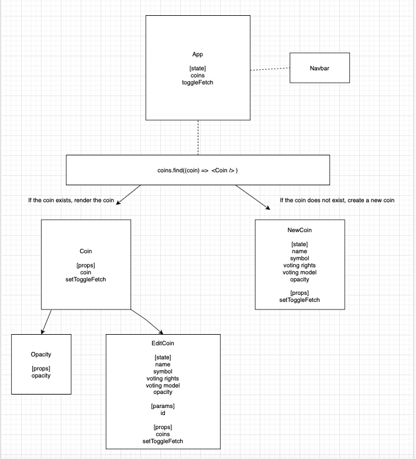

<-- CODENAME: BANANA -->

# Title
GovStack

# Description

A fundamental component of blockchain technology is decentralization; rather than allowing several major technology companies hold massive troves of user data within walled
gardens, blockchain technology seeks to put data ownership back in the hands of the users. Additionally, blockchain technology seeks to build decentralized business models
that rely extensively on the input of their stakeholders to help guide the product's direction. This is called governance, i.e. the way in which users interact with a company
to reach consensus on certain decisions and chart a path forward. This is seen as the optimal way to practice corporate stewardship in the future. However, the problem is that
governance models are seldom clear or easy to find. This opacity of governance is at best an oxymoron and at worst a severe hindrance to blockchain's progression as a 
socio-cultural-economic movement towards decentralized power distribution. In short, the accessibility of governance data is paramount to the success of the blockchain 
industry.

Enter GovStack, a database that seeks to aggregate governance data in a reliable, systematic way by relying on crowdsourcing community input. On GovStack, users can 
look up information relating to a specific crypto currency's governance model; if the data is either incorrect, partially missing, or fully missing, users can edit this
information. By adding information to the site, the user can earn TrustTokens, a reputation-based system designed to reward users who offer helpful input to the 
system. Thus, by relying on a trust-based framework, GovStack can build a community of students and contributors engaged with the blockchain space.

# Wireframes
### Desktop

### Mobile

# Component Hierarchy

I am not sure why this image is not rendering, but I am working on fixing it right now. Thanks! 

# API 
Within airtable, the following metrics are stored:

Initially, we will start with the following metrics: name, symbol, voting rights, voting model, and opacity. As we progress through our MVP, we will add in more data components.

# MVP
<ul>
  <li>MVP is a search bar that allows the user to search governance information for a specific coin.</li>
  <li>Source data from Airtable API listed above</li>
  <li>If the coin does not exist, allow the user to create a new entry for this coin.</li> 
  <li>If the coin exists, render the coin’s information as a specific component onto the page and allow the user to edit / update the current entry.</li>
  <li>Basic CSS styling using a combination of grid and flexbox</li>
</ul>

# Post-MVP
<ul>
  <li>Enable the user to visualize specific governance data using histograms by implementing D3</li>
  <li>Utilize Bootstrap to improve user experience</li>
  <li>Feature that hovers over a given word and provides a definition of that word</li>
  <li>White Paper explaining the purpose of this site in detail</li>
</ul>

# Project Schedule and Timeframes

# SWOT Analysis
<ol>
  <li>Strengths: I feel very comfortable with this concept and its associated data architecture; this data comes from a research paper I contributed to.</li>
  <li>Weaknesses: I am still not super comfortable with component hierarchy, as you may see from my component hierarchy above. I need to take today to really iron this concept out to make the rest of the week run smoothly.</li>
  <li>Opportunities: I want to use this project to really aggregate all of my React knowledge gained thus far and create a project that meaningfully represents my progress while also showcasing my interests and passions.</li>
  <li>Threats: I need to be sure I focus on completing my MVP and do not get lost in any rabbit holes of extra features. Get the main task done, deploy, and then worry about everything else. I tend to get distracted by the small details, so this will be a significant threat to my overall progress unless I stay strong to my course.</li>
</ol>
